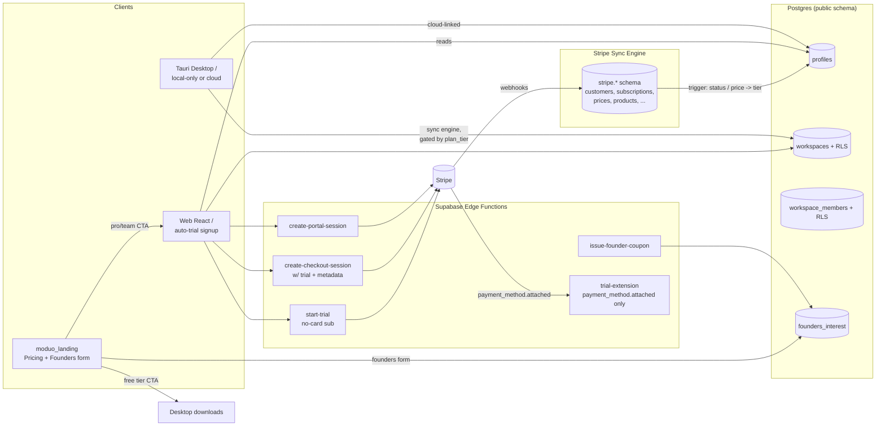

# moduo Billing & Entitlements Rollout

End-to-end wiring of the paid product across `moduo2.0` (web + Tauri) and `moduo_landing`, on Supabase project `moduohyb` (`wtoonrvuqumihpkbvwvs`).

## Locked decisions

- **Trial:** 7-day no-card trial on every cloud signup. Adding a card extends the trial to 30 days total (Stripe-native: `trial_period_days=7` + `payment_method_collection='if_required'`, then `subscriptions.update({ trial_end })` on `payment_method.attached`).
- **Web access:** Free tier cannot use the web app. Every new cloud signup auto-starts the 7-day trial, so all new web users are `pro/trialing` immediately. Post-trial without a card the subscription cancels and the user lands on the paywall page.
- **Workspace gate:** Free = 1 solo workspace. 2nd workspace → Pro paywall. Inviting any collaborator → Team paywall. Accepting an invite is always free. (Desktop local-only mode keeps unlimited local workspaces.)
- **Stripe Sync Engine = primary.** `stripe.*` mirrored schema is the source of truth; a Postgres trigger updates `profiles`. The custom webhook function is retired except for a narrow `payment_method.attached` handler used to extend trials.

## Architecture (target)



## Phase 1 — Stripe + Supabase plumbing

### 1a. Create Stripe products/prices (test mode)

One-shot setup. Two options, recommend (i):

- (i) **Run a script:** add `scripts/stripe-bootstrap.ts` that uses `STRIPE_SECRET_KEY` from `.env.local` to create Products + recurring Prices for Pro Monthly ($10), Pro Yearly ($96), Team Monthly ($9/seat), Team Yearly, plus a Founders coupon (100% off for 3 months). Each Product gets `metadata.plan_tier`. Each Price gets `metadata.plan_tier` and `metadata.billing_cycle`. Output the new `price_*` IDs.
- (ii) Manual via Stripe Dashboard — fine but error-prone for the price→tier mapping.

After creation, write the price IDs into both `.env.local` files and Supabase Edge Function secrets (script can also call `supabase secrets set` if available).

### 1b. Install Supabase Stripe Sync Engine

Use Supabase Dashboard → Integrations → **Stripe Sync Engine** on the `moduohyb` project (free, one-click). It will:

- Create the `stripe` schema with `customers`, `subscriptions`, `subscription_items`, `prices`, `products`, `invoices`, `payment_methods`, `charges`, `checkout_sessions`, etc.
- Provision its own webhook endpoint at `https://wtoonrvuqumihpkbvwvs.supabase.co/functions/v1/stripe-sync` and register it with Stripe.
- Backfill historical data.

`stripe` schema stays server-only (no PostgREST exposure).

### 1c. Add a narrow custom webhook for trial extension

Stripe Sync Engine doesn't react to events — only mirrors. We still need a small handler for `payment_method.attached`. Repurpose [supabase/functions/stripe-webhook/index.ts](supabase/functions/stripe-webhook/index.ts) as `trial-extension`:

- Listen only to `payment_method.attached`.
- If the customer has a `trialing` subscription, call `stripe.subscriptions.update({ trial_end: now + 23 days, proration_behavior: 'none' })` so total trial = 30 days.
- Configure Stripe Dashboard → Webhooks → second endpoint at `/functions/v1/trial-extension` subscribed only to `payment_method.attached`.

Drop all other handlers in that file (subscription created/updated/deleted/invoice.payment_failed) — the Postgres trigger handles those.

## Phase 2 — Database: trigger-driven entitlements + RLS gates

New migration `20260513000000_entitlement_rls_and_triggers.sql`:

### 2a. Postgres trigger: `stripe.subscriptions` → `public.profiles`

```sql
create or replace function sync_profile_from_stripe_subscription()
returns trigger language plpgsql security definer as $$
declare
  v_user_id uuid;
  v_tier text;
  v_price_id text;
begin
  -- user_id set via Stripe Customer metadata in start-trial / create-checkout-session
  select (metadata->>'supabase_user_id')::uuid into v_user_id
  from stripe.customers where id = new.customer;

  if v_user_id is null then return new; end if;

  v_price_id := (new.items->0->'price'->>'id');
  select metadata->>'plan_tier' into v_tier
  from stripe.prices where id = v_price_id;

  if new.status in ('active', 'trialing') then
    update public.profiles set
      plan_tier = coalesce(v_tier, 'pro')::plan_tier,
      stripe_customer_id = new.customer,
      stripe_subscription_id = new.id,
      subscription_status = new.status,
      current_period_end = to_timestamp((new.items->0->>'current_period_end')::bigint),
      plan_updated_at = now(),
      updated_at = now()
    where id = v_user_id;
  elsif new.status in ('canceled', 'incomplete_expired', 'unpaid') then
    update public.profiles set
      plan_tier = 'free',
      subscription_status = new.status,
      plan_updated_at = now(),
      updated_at = now()
    where id = v_user_id;
  end if;
  return new;
end$$;

create trigger trg_sync_profile_from_stripe
after insert or update on stripe.subscriptions
for each row execute function sync_profile_from_stripe_subscription();
```

### 2b. RLS: enforce 1-workspace-per-free-user

Add to `workspaces` INSERT policy:

```sql
create policy "free_users_max_one_workspace" on public.workspaces
for insert with check (
  (select plan_tier from public.profiles where id = auth.uid()) <> 'free'
  or (select count(*) from public.workspaces where owner_id = auth.uid()) = 0
);
```

### 2c. RLS: block invites/members for free workspaces

`workspace_invites` INSERT and `workspace_members` INSERT must check the workspace owner's `plan_tier IN ('pro','team','founder')`. Solo workspaces stay free; the moment they want a second member, owner needs Team.

Note: keep the existing "auto-add owner to workspace_members" migration intact; that's the only `workspace_members` insert allowed for free tier.

### 2d. Helpful views for the client

Create `public.user_entitlements` view (RLS so users see only own row), exposing `plan_tier`, `subscription_status`, `trial_ends_at`, `has_payment_method` (from `stripe.payment_methods` count), `current_period_end`. Use this in [src/hooks/use-entitlement.ts](src/hooks/use-entitlement.ts) instead of reading from `profiles` alone.

## Phase 3 — Edge functions

### 3a. New: `start-trial`

[supabase/functions/start-trial/index.ts](supabase/functions/start-trial/index.ts). Called once at end of OTP signup (web only):

- Auth via JWT, look up `profiles.stripe_customer_id`; create Stripe customer if missing with `metadata.supabase_user_id`.
- Check if customer already has any subscription (idempotent — abort if yes).
- `stripe.subscriptions.create({ customer, items: [{ price: STRIPE_PRICE_PRO_MONTHLY }], trial_period_days: 7, payment_method_collection: 'if_required', trial_settings: { end_behavior: { missing_payment_method: 'cancel' } }, metadata: { supabase_user_id, source: 'auto_trial' } })`.
- Return `{ trial_ends_at }`. The Sync Engine + trigger writes `plan_tier='pro'`, `subscription_status='trialing'` to `profiles` within a few seconds.

### 3b. Update: `create-checkout-session`

In [supabase/functions/create-checkout-session/index.ts](supabase/functions/create-checkout-session/index.ts):

- Add `subscription_data.trial_period_days: 7` and `payment_method_collection: 'if_required'` so Pro/Team CTAs from the landing also get the trial.
- Idempotency: if user already has an active subscription, redirect to portal instead of starting a second one.
- Keep `metadata.supabase_user_id` on customer + subscription (already does).
- Read `successUrl` / `cancelUrl` from query so it works as GET (current frontend uses GET) and POST.

### 3c. New: `trial-extension` (replaces the broad `stripe-webhook`)

[supabase/functions/trial-extension/index.ts](supabase/functions/trial-extension/index.ts) — handles only `payment_method.attached`:

```ts
if (event.type !== "payment_method.attached") return new Response("ignored", { status: 200 });
const pm = event.data.object as Stripe.PaymentMethod;
const subs = await stripe.subscriptions.list({ customer: pm.customer as string, status: "trialing", limit: 1 });
const sub = subs.data[0];
if (!sub) return Response.json({ skipped: "no_trialing_sub" });
const elapsedSec = Math.floor(Date.now() / 1000) - sub.start_date;
const target = sub.start_date + 30 * 24 * 60 * 60; // 30-day total
if (sub.trial_end && sub.trial_end >= target) return Response.json({ skipped: "already_extended" });
await stripe.subscriptions.update(sub.id, { trial_end: target, proration_behavior: "none" });
```

### 3d. Keep: `create-portal-session`, `manage-integration`, `issue-founder-coupon`

`issue-founder-coupon` needs a public-facing entry point — add `supabase/functions/founders-apply/index.ts` that records the request in `founders_interest` and emails the admin (re-using Resend secret), so the landing's “Get in touch” form is self-serve. The actual coupon issuance stays admin-only.

## Phase 4 — Auth, onboarding, and paywall page

### 4a. Auto-start trial on first cloud signup

In [src/components/auth/email-auth-panel.tsx](src/components/auth/email-auth-panel.tsx), after `verifyOtp` succeeds and `data.isNewUser === true` (or `!hasWorkspace`):

```ts
if (data.isNewUser) {
  await fetch(`${SUPABASE_URL}/functions/v1/start-trial`, {
    method: "POST",
    headers: { Authorization: `Bearer ${session.access_token}` },
  });
}
```

Then continue to `/onboarding` as today. If the URL had a `price_id`, skip the auto-trial (they explicitly chose a paid plan) and go directly to Checkout instead.

### 4b. New paywall page: `/paywall`

Add `src/routes/pages/paywall-page.tsx`. Shown when:

- Cloud-linked user on web with `plan_tier = 'free'` AND `subscription_status NOT IN ('trialing','active')`. Web's `AppGate` redirects here instead of mounting `AppChrome`.
- Inside the app, when `UpgradeModal` is dismissed and the gated action is critical, optionally route here.

Page renders the 3 plan cards (mirrors landing's `Pricing.tsx`) with `priceId` from env, calls `create-checkout-session`, and (for any user who somehow has no subscription) offers a "Start free 7-day trial" button calling `start-trial`.

Wire in [src/routes/layouts/app-gate.tsx](src/routes/layouts/app-gate.tsx):

```mermaid
flowchart TD
    Start([cloud user signs in]) --> Profile[Read profiles row]
    Profile --> WebQ{Web or desktop?}
    WebQ -->|Desktop| AppShell[Always allow app shell<br/>local-only data works]
    WebQ -->|Web| StatusQ{subscription_status}
    StatusQ -->|"trialing or active"| AppShell
    StatusQ -->|"none, canceled, past_due"| Paywall[/paywall]
    Paywall --> StartTrialOrCheckout
```

### 4c. Update `onboarding-page` to show trial confirmation

Currently it silently creates a workspace and redirects. After Phase 4a, show a single screen: "Your 7-day trial is active. Add a card any time in Settings → Billing to extend it to 30 days." Then create workspace + go to `/`.

## Phase 5 — Wire the in-app paywall

### 5a. Workspace switcher: gate "+ New workspace"

In [src/components/workspace-switcher.tsx](src/components/workspace-switcher.tsx), wrap the "+" handler:

```ts
const { allowed, upgrade } = useEntitlement("unlimited_workspaces");
const onAdd = () => {
  if (workspaces.length >= 1 && !allowed) {
    setUpgradeOpen(true);
    return;
  }
  void createWorkspace(...);
};
```

Render `<UpgradeModal visible={upgradeOpen} feature="unlimited_workspaces" onClose={...} />`.

### 5b. Workspace settings modal: gate invite UI

In [src/components/workspace-settings-modal.tsx](src/components/workspace-settings-modal.tsx), wrap the "Invite User" form:

```ts
const { allowed } = useEntitlement("team_members");
// disable the form + show inline "Upgrade to Team to invite collaborators" button → opens UpgradeModal
```

### 5c. Settings → Billing: in-app checkout instead of landing link

In [src/routes/pages/settings-page.tsx](src/routes/pages/settings-page.tsx) `handleOpenBillingPortal` is fine for paid users. Replace the free-tier "Upgrade to Pro →" button (currently `window.open("https://moduo.app/#pricing")`) with a call to `useEntitlement("cloud_sync").upgrade()` so we stay in-app and pass the access token through the existing `redirectToCheckout` helper.

### 5d. Surface trial state

Add a small `<TrialBanner />` component in `AppChrome`:

- Reads `user_entitlements` view.
- Shows "X days left in trial — add a card to extend to 30 days" if `subscription_status='trialing'`. CTA → Settings → Billing → portal.

## Phase 6 — Desktop-only recovery key

In [src/routes/pages/settings-page.tsx](src/routes/pages/settings-page.tsx) `leftPanel`:

```ts
{isDesktop && (
  <Pressable onPress={() => setSection("login-key")}>Login Key</Pressable>
)}
```

Also defend the section body: if `!isDesktop && section === "login-key"`, redirect to `"profile"`. The `runtime.auth.getStoredMnemonic` on web already returns a "Desktop only" error, but UX-wise the entry shouldn't exist.

## Phase 7 — Free-tier sync gate (desktop)

Today [src-tauri/src/commands/auth.rs](src-tauri/src/commands/auth.rs) `start_sync_worker_if_needed` starts the sync worker on any cloud JWT. Add a tier check:

- New Rust helper `fn read_plan_tier(client: &reqwest::Client, supabase_url: &str, jwt: &str) -> Option<String>` that hits `GET /rest/v1/profiles?select=plan_tier&id=eq.<uid>`.
- `start_sync_worker_if_needed` skips startup if `plan_tier == "free"`.
- The worker self-stops if a periodic check shows downgrade to free.

This means free-tier desktop users keep all local data but stop pushing to Supabase. UX in Settings → Cloud Sync should reflect: "Cloud sync requires Pro. Manage subscription in Billing."

## Phase 8 — Remove legacy P2P stub

Single PR:

- Delete [src-tauri/src/replication_iroh/mod.rs](src-tauri/src/replication_iroh/mod.rs) and the `pub mod replication_iroh;` line in [src-tauri/src/lib.rs](src-tauri/src/lib.rs).
- Delete `src-tauri/src/commands/p2p.rs` and its registrations in `lib.rs` (`p2p_start`, `p2p_peer_status`, `p2p_sync_now`).
- Drop `p2p: replication_iroh::P2pManager` from `AppState`.
- Frontend: delete `p2p` from [src/lib/runtime.types.ts](src/lib/runtime.types.ts), [src/lib/runtime.tauri.ts](src/lib/runtime.tauri.ts), [src/lib/runtime.web.ts](src/lib/runtime.web.ts), set `hasP2P: false` everywhere (or remove the capability entirely). Grep for `p2p_*` consumers in `src/` — none expected, but verify.

Since there's zero iroh dependency in `Cargo.toml`, this is purely dead-code removal — no behavior change.

## Phase 9 — Landing page changes (`moduo_landing`)

### 9a. Pricing: free tier → desktop download

In [moduo_landing/src/components/landing/Pricing.tsx](moduo_landing/src/components/landing/Pricing.tsx):

- Replace the free-tier button (currently an inert `Get Started` or similar) with a `<DesktopDownloadButton />` that detects OS via `navigator.userAgent` and links to a placeholder URL (`/download/mac`, `/download/win`, `/download/linux`). Leave the actual asset wiring for a future PR — this PR only changes the button.

### 9b. Add the `#founders-interest` form

Currently the button scrolls to a hash that doesn't exist. Add `<FoundersInterest />` component before `FAQ` with an email + message form posting to `/api/founders-interest` (already exists). Confirm with a “We’ll reach out within 48h” success state.

### 9c. Verify Supabase URL points to `moduohyb`

Already wired per the read of [moduo_landing/src/lib/supabase.ts](moduo_landing/src/lib/supabase.ts). No-op if `.env.local` is correct.

## Phase 10 — Smoke tests

Add Playwright suites at `e2e/billing/` covering the critical paths:

- **Web first-time signup → trial active:** OTP signup → `start-trial` called → `profiles.plan_tier='pro'` & `subscription_status='trialing'` → app loads with `TrialBanner`.
- **Trial extension:** seed a `trialing` sub → simulate `payment_method.attached` Stripe event → `trial-extension` extends to 30 days.
- **Workspace paywall:** free user (post-trial expired) clicks "+" workspace → `UpgradeModal` opens.
- **Invite paywall:** Pro user tries to invite collaborator → `UpgradeModal` opens for Team.
- **Web paywall page:** free-tier user lands on `/paywall`, not `/`.
- **Desktop local-only:** offline mnemonic flow still works, no Stripe calls made.
- **Sync gate:** desktop free-tier user does NOT spawn the sync worker (assert via log line `[sync] worker shutdown`).
- **Landing → download:** free CTA on landing routes to `/download/<os>`.
- **Founders form:** submit → row in `founders_interest`, admin email sent.

## Phase 11 — Rollout sequence

1. Phase 1 (Stripe products + Sync Engine + secrets) — manual / scripted, no code merge.
2. Phase 2 migrations (RLS + trigger). Verify in staging: create dummy subscription via Stripe CLI, watch `profiles` update.
3. Phase 3 edge functions deploy. Test `start-trial`, `trial-extension` via Stripe CLI events.
4. Phase 8 (P2P removal) — independent, low-risk; merge first to shrink surface.
5. Phase 6 (login-key gate), Phase 7 (sync gate), Phase 5 (in-app paywall) — frontend PRs, parallelizable.
6. Phase 4 (auth + onboarding + paywall page) — the user-visible centerpiece, merge after the gates exist.
7. Phase 9 landing updates.
8. Phase 10 Playwright suite.

## Open follow-ups (NOT in this plan)

- Mobile (still out of scope).
- Desktop auto-update download wiring on the landing.
- Team-plan seat quantity sync (auto-update `quantity` on subscription as members join). Punt to v2.
- Real Sentry/PostHog wiring (analytics events already fire to `Analytics.*` helpers; just need keys).