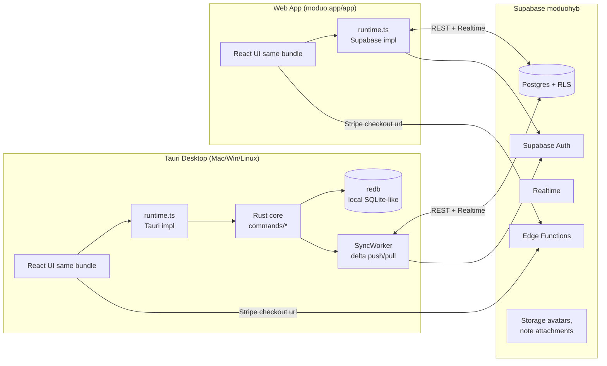
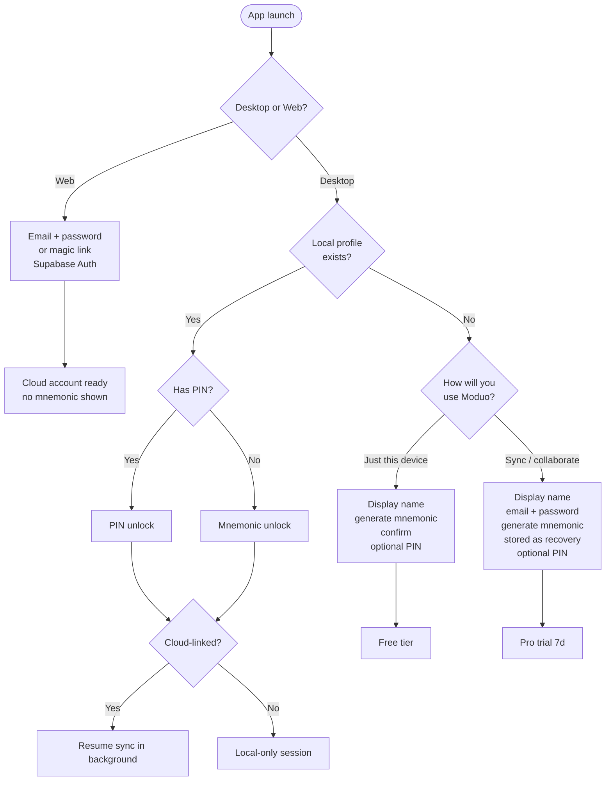
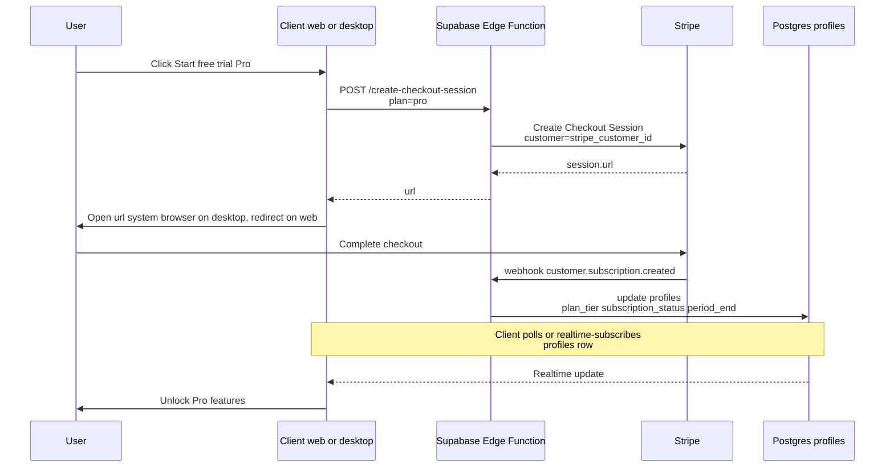

# moduo Hybrid: Web + Desktop, End-to-End Plan

> **⚠️ RETIRED (2026-06-12, improvement-plan Session 2).** This plan specced the
> local-first hybrid: redb as desktop source of truth, an `auth_link_to_cloud`
> upgrade flow, and a delta-sync engine. That architecture was **superseded by
> the cloud-first pivot (2026-06-11)**: desktop now runs the Supabase-backed web
> runtime directly for auth/workspaces/tasks (see `docs/improvement-plan.md`),
> the `auth_link_to_cloud` Rust command was never built, and the sync-engine
> skeleton in `src-tauri/src/sync/` is paused. Do **not** implement the pending
> todos below. Kept for the billing/landing context and as input to the future
> free local-first **lite** version.

A consolidated direction across five axes (architecture, onboarding, billing, tooling, framework review), built on the decisions you locked in:

- **Storage model: B — Thin web client.** Web talks to Supabase directly. Desktop stays local-first on `redb` and pushes deltas to Supabase for cloud-synced users.
- **Platform scope: Web + Tauri desktop only.** No mobile in this push.

The new Supabase project to use everywhere is **`moduohyb`** (`ref: wtoonrvuqumihpkbvwvs`, EU-West-2, Postgres 17, active). The legacy project URL currently hardcoded in [src/features/notes/utils/expose.ts](src/features/notes/utils/expose.ts), [src/features/plan/utils/expose-slot.ts](src/features/plan/utils/expose-slot.ts), [src/features/plan/hooks/use-slot-bookings-sync.ts](src/features/plan/hooks/use-slot-bookings-sync.ts), [src-tauri/src/config.rs](src-tauri/src/config.rs), and [moduo_landing/src/lib/supabase.ts](moduo_landing/src/lib/supabase.ts) needs to migrate to it.

---

## 1. Architecture — making web work alongside desktop

### High-level model

### Frontend split

- **One React bundle, two builds.** Keep `rsbuild.config.ts`; add a new entry `src/main.web.tsx` (or a `MODUO_TARGET=web|desktop` define) so we tree-shake Tauri-only code. Add two scripts: `dev:web` / `build:web` alongside the existing `dev:desktop` / `build:desktop`.
- **Runtime abstraction is already there.** [src/lib/runtime.ts](src/lib/runtime.ts) currently returns `null` outside Tauri. Replace that with a real `WebModuoRuntime` that satisfies the same `ModuoRuntime` interface but is backed by `@supabase/supabase-js` instead of `invoke(...)`. Every feature module already consumes `runtime.*`, so no UI rewrites are needed for the cloud-only paths.
- **Direct `invoke` sites must be wrapped.** A handful of files bypass `runtime` and import `@tauri-apps/api` directly: [src/components/integrations-modal.tsx](src/components/integrations-modal.tsx), [src/features/email/ui/email-workspace.tsx](src/features/email/ui/email-workspace.tsx), [src/routes/pages/settings-page.tsx](src/routes/pages/settings-page.tsx), [src/features/calendar/hooks/use-calendar.ts](src/features/calendar/hooks/use-calendar.ts). Move all of them behind `runtime.*` methods (new `runtime.integrations`, `runtime.email`, `runtime.calendar`) so the web build has a single dependency surface to fulfill.
- **Desktop-only features get gated UI.** Email (IMAP/SMTP), calendar OAuth flows that require `localhost` redirect, and time-tracking that uses `active-win-pos-rs` cannot run on web. The nav uses `modulePermissions` already in [src/components/app/app-chrome.tsx](src/components/app/app-chrome.tsx); add a parallel `platformCapabilities` filter sourced from the runtime (`runtime.capabilities`).

### Web runtime (new file: `src/lib/runtime.web.ts`)

Implements every `ModuoRuntime` method via Supabase:
- `auth.*` → `supabase.auth.*`
- `workspace.*`, `notes.*`, `tasks.*` → `supabase.from('workspaces' | 'notes' | ...)` with RLS doing the security
- Notes CRDT: web reads the latest `doc_state bytea` and uses a Yjs `Y.Doc` in memory; on save it pushes the new state. Multi-tab collaboration uses Supabase **Realtime Broadcast** channel `note:<id>` rather than persisting every op.
- `email`, `timetracking`, integrations OAuth: return `{ error: { message: "Desktop only" } }` and let the UI hide those modules via capabilities.

### Desktop sync engine (new Rust module: `src-tauri/src/sync/mod.rs`)

A background tokio task that:
1. On startup (and on every redb write), enqueues a delta in a new `SYNC_OUTBOX` table.
2. Flushes the outbox to Supabase REST (using the user's Supabase JWT, not the current UUID-only token — see §2).
3. Subscribes to Supabase Realtime on `workspace:<id>` and applies inbound rows to redb.
4. Handles conflict resolution with **last-writer-wins on scalar rows** and **CRDT merge for Yjs `doc_state`** (Y-CRDT is naturally idempotent).
5. Runs only when the user is on a paid plan (gate on `profiles.plan_tier`).

### Supabase schema (in `moduohyb`)

New migrations (apply via Supabase MCP `apply_migration`), all RLS-enforced:

- `profiles` — `id uuid PK references auth.users`, `display_name`, `avatar_url`, `plan_tier enum(free,pro,team,founder)`, `subscription_status`, `stripe_customer_id`, `current_period_end`, `local_user_id` (for binding existing desktop installs to a cloud user).
- `workspaces` — owned by `profiles.id`; soft-delete column.
- `workspace_members`, `workspace_invites`, `workspace_notifications` — mirror current redb tables.
- `notes` — `doc_state bytea`, plus indexable scalar columns (title, parent_id, position). RLS: workspace membership.
- `tasks_projects`, `tasks_states`, `tasks_items`, `tasks_comments`.
- `calendar_events`, `dashboard_layouts`, `panel_layouts`.
- Keep existing public tables for the landing: `exposed_notes`, `exposed_slot_links`, `slot_bookings`, `slot_conflict_windows`, `user_integrations`, `waitlist` — re-create in `moduohyb`.
- `subscription_events` — Stripe webhook log.

### Landing repo (`moduo_landing`)

- Re-point `NEXT_PUBLIC_SUPABASE_URL` and `NEXT_PUBLIC_SUPABASE_PUBLISHABLE_DEFAULT_KEY` in [moduo_landing/.env.local](moduo_landing/.env.local) to `moduohyb`.
- Add a real `/app` (or subdomain `app.moduo.app`) that serves the web build from this repo.
- Wire the pricing CTAs in [moduo_landing/src/components/landing/Pricing.tsx](moduo_landing/src/components/landing/Pricing.tsx) `Button` (currently inert) to `/app?signup=pro|team` and `/app?signup=founder` for the early-founders flow.
- The `#login` / `#signup` anchors in [moduo_landing/src/components/ui/navigation.tsx](moduo_landing/src/components/ui/navigation.tsx) currently point nowhere — replace with `/app/login` and `/app/signup`.

---

## 2. Onboarding — the three modes

We support three account states. The UX explicitly asks the user once on first run, but lets them upgrade later.

### The three modes

1. **Local-only (Free).** Today's mnemonic flow stays. Profile + Argon2 hash in redb, optional PIN, no Supabase account. `runtime.auth` does not contact the network. Mnemonic is the only recovery path. This is the path in [src/components/auth/email-auth-panel.tsx:11](src/components/auth/email-auth-panel.tsx) `entry → create_profile → create_phrase → finishCreateVault`.

2. **Cloud-synced (Pro, individual).** User signs up with email + password (or magic link) via Supabase Auth. We **also** generate a BIP-39 mnemonic locally and show it as a "recovery seed" — same UX as today, but its role is to let them re-attach a new device without going through email recovery. Server stores `auth.users.id`, `profiles.local_user_id` = the mnemonic-derived id, plus a `recovery_seed_hash` (Argon2(mnemonic)) so a future device can prove ownership via the mnemonic *or* via the email. Local data still encrypted in redb; **no end-to-end encryption in v1** — RLS is the security boundary.

3. **Team (Pro for groups).** Same as cloud-synced + workspace seats. Invites are issued through `workspace_invites` (already in redb today; same shape in Postgres). Accepting an invite requires a Supabase account.

### Web has no offline / mnemonic

On the web there is no secure place to keep a mnemonic that survives "clear browser data", so the web flow is **email + password (or magic link) only**. Mnemonic recovery exists as a *fallback for desktop devices* — the web app does not surface it.

### Auth tokens — replace the UUID with a Supabase JWT

Right now [src-tauri/src/commands/auth.rs](src-tauri/src/commands/auth.rs) mints a UUID as `access_token`, while [src/features/plan/hooks/use-slot-bookings-sync.ts:119](src/features/plan/hooks/use-slot-bookings-sync.ts) already comments "Supabase JWT". For sync to work, the desktop must hold a real Supabase JWT once the user is cloud-linked:

- On cloud signup/login, call `supabase.auth.signInWithPassword` from the Rust side (or proxy via an edge function) and persist the `access_token` + `refresh_token` in keychain alongside the existing local session.
- The runtime exposes `runtime.auth.getCloudSession()` to TS code that needs to query Supabase directly (slot sync, expose, etc.).
- Local-only users keep the UUID session — it never leaves the device.

### Upgrade path: local → cloud

A "Enable cloud sync" action in Settings:
1. Prompt for email + password.
2. `auth_link_to_cloud` Rust command: signs up Supabase user, sets `profiles.local_user_id` to the existing local id, dumps every redb table to Supabase in a single transaction, flips a `cloud_linked: true` flag.
3. Sync engine starts.

---

## 3. Pricing & billing layer

### Choice: Stripe + Supabase (not RevenueCat)

RevenueCat's value is unifying Apple/Google IAP across iOS/Android. Since mobile is out of scope, Stripe Checkout + Customer Portal + Supabase webhook is the leaner choice, and works identically on web and desktop (desktop opens the Checkout URL in the system browser via the existing `open_external_url` command).

### Flow

### Plans (from the landing copy)

| Tier | Price | Implementation |
|---|---|---|
| **Free** | $0 | Local-only mode. No Supabase account required. |
| **Pro** | $10/mo or $96/yr, 7-day no-card trial → 1 month after card added | One Stripe product, two prices, trial via `trial_period_days` |
| **Team** | $9/seat/mo, min 2 seats | Stripe metered/quantity subscription; seat count = `workspace_members.count` |
| **Early Founders** | $0 for 3 months, full Team plan, up to 6 seats | Manual onboarding via "Get in touch" → coupon code + capped Team subscription |

### Edge functions to ship (in `moduohyb`)

- `create-checkout-session` — input `{ plan, billing_cycle }`, returns URL.
- `create-portal-session` — for users to manage cards/cancel.
- `stripe-webhook` — handles `customer.subscription.{created,updated,deleted}`, `invoice.payment_failed`. Writes to `profiles` + `subscription_events`.
- `manage-integration` — already exists in legacy project; re-deploy under `moduohyb` so [src-tauri/src/commands/integrations.rs](src-tauri/src/commands/integrations.rs) keeps working.

### Entitlement enforcement

A single helper `useEntitlement(feature)` reads `profiles.plan_tier` and gates UI. Server-side, RLS policies on `workspaces`/`notes` ignore plan tier (the data is theirs either way), but **the sync engine is gated by plan_tier** — a downgraded user keeps their local data, just stops syncing.

---

## 4. Tooling, libraries, services

### Adds

- **`@supabase/supabase-js`** in both `moduo2.0` and (already present in) `moduo_landing`.
- **`stripe`** SDK in edge functions only.
- **`@tanstack/react-query`** — strongly recommended for the web runtime path. Caching, retries, optimistic updates, realtime cache invalidation. Even on desktop it cleans up the ad-hoc state in feature hooks.
- **`zod`** — already in deps, use it for Supabase row schemas (single source of truth between TS and migrations) and validate edge function inputs.
- **`supabase` CLI** — for migrations and `supabase gen types typescript --linked` to produce `src/types/supabase.ts`.
- **A logger** — `pino` (TS) + `tracing` (Rust, already present) configured to a debug overlay in dev.

### Services

- **Supabase moduohyb** — Auth, Postgres, Storage (avatars, exposed-note assets), Realtime, Edge Functions.
- **Stripe** — billing.
- **Resend** — already used by landing for booking emails; reuse for transactional emails (verify-email, invite, password-reset templates) instead of Supabase's default SMTP.
- **Sentry** (recommended new) — both desktop (Rust + TS) and web. Without it, debugging cross-platform sync bugs will be miserable.
- **PostHog or Plausible** (recommended new) — onboarding funnel + plan conversion analytics.

### Drop / replace

- **Hardcoded Supabase URL + anon key** in [src/features/notes/utils/expose.ts:11](src/features/notes/utils/expose.ts), [src/features/plan/utils/expose-slot.ts:3](src/features/plan/utils/expose-slot.ts), [src/features/plan/hooks/use-slot-bookings-sync.ts:24](src/features/plan/hooks/use-slot-bookings-sync.ts) → read from `PUBLIC_SUPABASE_URL` + `PUBLIC_SUPABASE_ANON_KEY` via Rsbuild's `PUBLIC_*` define mechanism (same pattern Rsbuild already uses for market keys).
- **`MODUO_SUPABASE_URL` default** in [src-tauri/src/config.rs:54](src-tauri/src/config.rs) → flip to `moduohyb` URL.
- **`MODUO_TOKEN_ENCRYPTION_SECRET`** is currently used to encrypt integration tokens before sending to Supabase ([src-tauri/src/commands/integrations.rs](src-tauri/src/commands/integrations.rs)). Keep this; it's a sound pattern.

---

## 5. Framework / library review of existing project

Overall: the stack is in good shape. Concrete suggestions:

- **Keep**: React 19, TanStack Router, Tailwind 4, Lexical, Yjs, xyflow, Tauri 2, redb, Rust async stack. None of these block the web build, and replacing any would cost weeks for no gain.
- **Rsbuild** — fine. The two-target build (web/desktop) is one config change.
- **State**: pure React Context + local state has worked, but with sync + realtime it will hurt. Introduce **TanStack Query** for server-cache and keep Context for UI state. Don't introduce Zustand/Redux/Legend-State now — Query is enough.
- **Auth UI**: the current [src/components/auth/email-auth-panel.tsx](src/components/auth/email-auth-panel.tsx) is solid for the local flow. Don't adopt `@supabase/auth-ui-react` — its theming would clash; build the cloud signup forms inline.
- **Routing**: `/auth` is currently a single page that branches via internal `Flow` state. Split it into `/auth/local`, `/auth/cloud`, `/auth/recover` once the second mode lands — keeps history/back-button sane and is trivial with TanStack Router.
- **Tests**: Vitest + Playwright are present but lightly used. Add Playwright suites for (a) local-only onboarding, (b) cloud onboarding on web, (c) link-to-cloud upgrade on desktop. These three paths are the highest-risk regressions.
- **Email/calendar features** are deeply Rust-coupled (IMAP, OAuth). Don't try to port them to web — gate them as "desktop only" in nav. Keep the door open to later move them behind a server worker if needed.
- **`active-win-pos-rs` time tracking** is desktop-only by definition. Web shows a read-only summary of synced entries.
- **Iroh P2P** ([src-tauri/Cargo.toml](src-tauri/Cargo.toml)) — keep, but make it **optional / opt-in for Team**. Supabase handles realtime collaboration for the default path; Iroh becomes an LAN/airgapped bonus rather than the primary collaboration channel. Avoid expanding it until v2.

---

## Phased rollout

The plan is broken into tracks. The TODOs below are ordered milestones, not micro-tasks — each one is a multi-PR effort.
